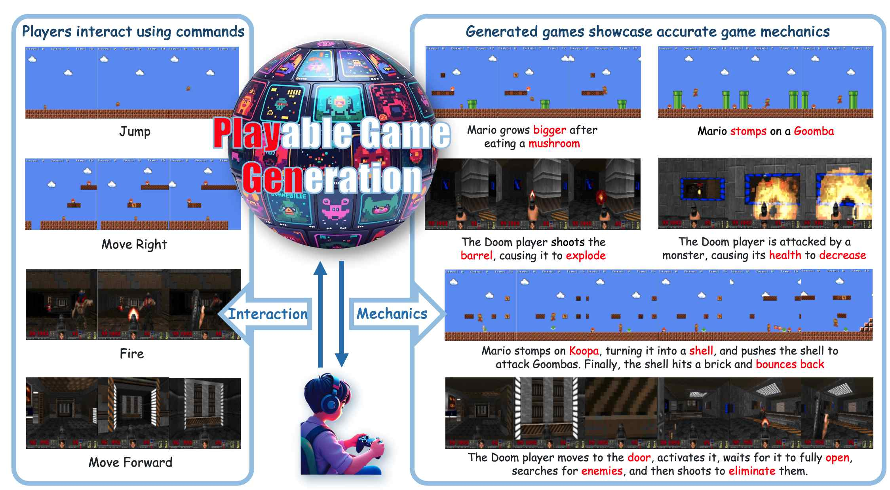
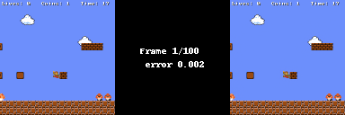
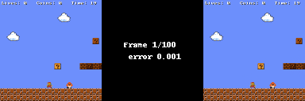

#  Playable-Game-Generation


The **Playable Game Generation** (**PlayGen**) paradigm is an open-source, lightweight framework for game generation. It includes everything from data processing to model architecture design and playability-based evaluation methods. The game runs at 20 FPS on a single consumer-grade graphics card (RTX-2060) while maintaining high playability.

If you want to know more details about the implementation, please refer to our **Paper**
[**Playable Game Generation**](https://arxiv.org/abs/2412.00887)

We have provided two addresses for you to experience the **Demo online**. If you encounter any lag, you can switch between the different addresses:
[**Online Demo 1**](http://124.156.151.207/) or [**Online Demo 2**](http://120.233.114.40/)

Due to load and network latency, the online demo may experience some lag. In the current repository, we also provide a **Locally Runnable Demo** and script inference modules.

# 🏭 Setup
We recommend using `conda` to build the base environment.
```
git clone https://github.com/PlayableGameGeneration/Playable-Game-Generation.git
cd Playable-Game-Generation
conda create --name pgg python=3.8
conda activate pgg
pip install -r requirements.txt
```
Please download the model checkpoint from [Google Drive](https://drive.google.com/file/d/1jMHJAcWRysXtCyOk0O6XRcvEsuiPEU2H/view?usp=sharing) and put it in `./ckpt`

Before starting, you need to set the running device in `config.py`. The default is `device = "cuda:0"`.
# 🕹️ Runing a Simulation
We offer two simulation modes:

1. **Direct Inference**: Given a sequence of preceding game frames and action sequences, generate subsequent frames.
```
python infer.py -i <image_path> -a <action_sequence>
# eg:
python infer.py -i ./eval_data/demo.png -a r,r,r,r,r,r,r,r
```
The term `<action_sequence>` refers to the sequence of actions for each frame, separated by commas. The specific categories include `l->left, r->right, j->jump, f->fire, lj->left jump, rj->right jump, and n->null`.

After execution, a gameplay recording will be generated as `./output/output.gif.`

2. **Local Webpage**: Launch a local webpage for simulation, supporting online interaction to generate game frames in real-time.
```
python app.py
```
Open the web page at http://localhost:8080 and you will see the following interface.

Before clicking `Start Game`, you can configure the **Game Gettings**. If you change the game settings while the game is running, you will need to trigger `Start Game` again for the changes to take effect.Here is an explanation for each setting:
- **Random Init**: If True, Mario will be randomly initialized in different positions; otherwise, Mario will be initialized at the beginning of the level.
- **Block**: If True, the simulation will remain paused until it receives an action command; otherwise, the simulation will continue running by receiving **Null** command.
- **Denosing Step**: Controlling the diffusion steps of the diffusion model.

In the game, you can use the mouse to click buttons for control, or you can use the keyboard arrow keys and the Z key for control.

# 📹 Demo Display
Here are some example demonstrations, including Mario and Doom. On each GIF, the left side is the ground truth, and the right side is the model prediction. `error` represents the cumulative error.
### Super Mario





### DOOM


# ✅ TODO List
- [x] inference module and model weight of Mario
- [x] local web application
- [X] online demo
- [ ] model weight of DOOM
- [ ] training module and dataset


# ⭐️ Citation
If you use this project in your research, please cite our paper:
```
@misc{yang2024playablegamegeneration,
      title={Playable Game Generation}, 
      author={Mingyu Yang and Junyou Li and Zhongbin Fang and Sheng Chen and Yangbin Yu and Qiang Fu and Wei Yang and Deheng Ye},
      year={2024},
      eprint={2412.00887},
      archivePrefix={arXiv},
      primaryClass={cs.AI},
      url={https://arxiv.org/abs/2412.00887}, 
}
```